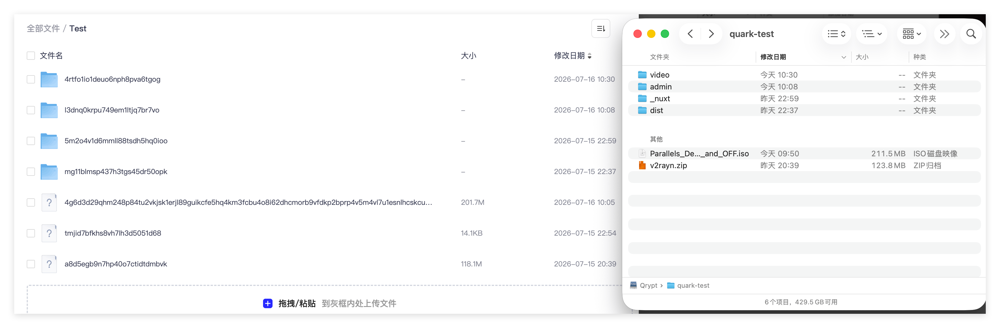

[English](README.md)

# qrypt

把你的云盘变成一个加密本地文件夹 —— 挂载、打开、像普通硬盘一样用。



## 功能特性

- **FUSE 挂载** — 所有云盘挂载到同一个本地目录下，每个云盘一个子目录
- **rclone 兼容加密** — 文件名混淆和内容加密，与 rclone crypt 兼容
- **可插拔云盘后端** — 完整列表见[支持的驱动](docs/for-user/support-drivers.md)
- **本地读缓存** — 缓存远端文件数据，重复访问无需重新下载
- **异步写入** — 新文件和修改先写入本地，再异步上传到云盘，支持去抖、并发、重试
- **跨平台 FUSE** — macOS (macFUSE)、Linux (libfuse)、Windows (WinFsp)
- **macOS 优化** — 自动屏蔽 Apple Double 元数据和扩展属性，Finder 中无垃圾文件
- **诊断工具** — debug 调试接口，结构化 JSON 报告，挂载健康监控，一致性检查和 staging 审查
- **带宽控制** — 分别限制上传和下载速度
- **配置自动发现** — 依次查找 `./qrypt.toml`、`~/.qrypt/qrypt.toml`，然后在 Unix 查找 `$XDG_CONFIG_HOME/qrypt/qrypt.toml`，或在 Windows 查找 `%AppData%\qrypt\qrypt.toml`

## 系统要求

| 依赖           | macOS                          | Linux                 | Windows                       |
| -------------- | ------------------------------ | --------------------- | ----------------------------- |
| FUSE           | [macFUSE](https://macfuse.io/) | libfuse（通常已预装） | [WinFsp](https://winfsp.dev/) |
| Go（源码构建） | 1.26+                          | 1.26+                 | 1.26+                         |

`fs` 命令（list、cat、get、put）不需要 FUSE，只有 `mount` 需要。
配置文件会自动查找，配置文件放在标准路径时可以省略 `--config` 参数（见[命令行参考](docs/for-user/cli.md)）。

## 快速开始

1. 从 [releases 页面](https://github.com/yinzhenyu-su/qrypt/releases) 下载对应系统的压缩包
2. 创建 `qrypt.toml`：

```toml
mount_point = "~/Qrypt"

[[mounts]]
# 挂载点名称
name = "local"
type = "localfs"

[mounts.params]
root_path = "/tmp/qrypt-data"

[mounts.encryption]
password = "my-password"
filename_encryption = "standard"
filename_encoding = "base32"
```

3.1 没有挂载时上传文件并检查加密结果：

```bash
mkdir -p /tmp/qrypt-data
./qrypt fs list /
echo "hello qrypt" > /tmp/hello.txt
./qrypt fs put /tmp/hello.txt /local/hello.txt
./qrypt fs cat /local/hello.txt
```

查看后端实际存储的文件——文件名已被加密为乱码：

```bash
ls /tmp/qrypt-data
```

输出类似：

```
b4l6gr1s6t1q0tas6dl0q0mb0s62kbj0
```

原始文件名和文件内容都已被加密。

3.2 挂载后操作

```bash
./qrypt mount
```

打开文件管理器进入 `~/Qrypt`，可以像操作普通文件夹一样拖入和打开文件。
所有操作的文件在后端存储时都会被加密。

文件在后端存储时是加密的——后端目录里看到的是混淆过的文件名和二进制乱码。
详细上手教程（含加密效果演示和 Windows 注意事项）→
[docs/for-user/quickstart.md](docs/for-user/quickstart.md)

## 用户文档

- [快速上手](docs/for-user/quickstart.md) — 最小配置，5 分钟跑通，含加密效果演示
- [命令行参考](docs/for-user/cli.md) — 命令、参数、输入输出和配置查找规则
- [完整配置参考](docs/for-user/full-config.md) — 全部配置项说明
- [支持的驱动](docs/for-user/support-drivers.md) — 各云盘驱动的参数列表

## 开发者文档

- [架构概览](docs/for-developer/architecture.md) — 分层设计与规则
- [驱动开发](docs/for-developer/driver-development.md) — 如何接入新的云盘后端
- [调试](docs/for-developer/debug.md) — 诊断工具和故障排查

## 从源码构建

需要 Go 1.26+ 和 FUSE 头文件（Linux 上为 libfuse-dev，macOS 上为 macFUSE）。

```
git clone https://github.com/yinzhenyu-su/qrypt.git
cd qrypt
go build ./cmd/qrypt
```

## 许可证

MIT
